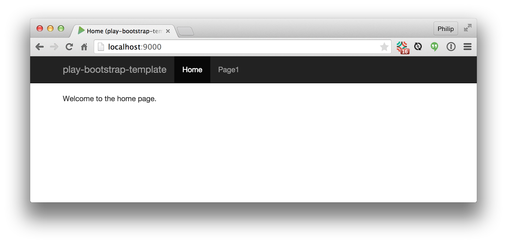

# ics-play-bootstrap

## Overview

This is a revised version of the Activator 'play-java' template system which:

  * Conforms to the ICS software engineering coding standards

  * Illustrates how to incorporate Twitter Bootstrap 3 into Play.

To use it, first create an empty GitHub repo and clone to your desktop.

Next, cd into your new repo and set this repo as the upstream master:

    git remote add upstream https://github.com/ics613s15/ics-play-java.git

Finally, merge the contents of ics-play-java into your new empty repo:

    git fetch upstream
    git merge upstream/master

Now your repo will contain the ics-play-java repo.

Edit the build.sbt file to change the name to your new project.

## Features

ics-play-bootstrap provides the following features:

  * Modifications to the "play-java" Activator template to eliminate checkstyle errors.

  * Modifications to [Main.scala.html]() template to load [Twitter Bootstrap 3](http://getbootstrap.com/) files using CDN sites.

  * Modifications to illustrate simple page navigation through changes to the [controller](), [routes](), and [view]() files.

  * The [navbar]() highlights the current active page through a parameter passed from the controller.

  * The [main.css]() adjusts body padding due to the use of the fixed-top navbar.

  * Support for simple [tests]().

## Screencast

A short screencast containing a walkthrough of these features is available here.

## Version information

Play 2.3.7, Bootstrap 3.2.3

